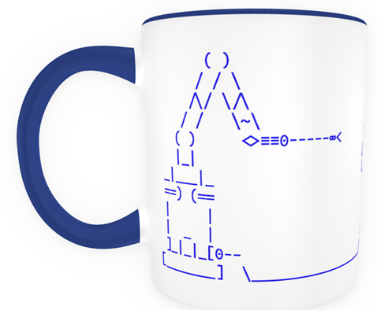

# ASCII Versius
This repo contains ASCII art of the Versius robotic system for minimally invasive surgery, manufactured by CMR Surgical. The designs were created by Emma Rhodes and John Till, and are made available here for fair use. This is *not* an official product, and not approved in any official capacity by CMR. Any use should respect CMR's ownership of the Versius brand.

## Mugs

The ASCII art was used to produce a batch of mugs via VistaPrint. [ascii_versius_mug.png]() is the starting point for the digital design supplied to the printers. We created colour variations, such as [ascii_versius_mug_pride_progress.png]().

One of the learnings is that printing on black mugs uses a different printing process, where the image is printed on a white background and the black is filled in during printing. This introduces a risk that the background will bleed into the image, so the lines are thicker and brighter in the digital image to compensate. The dark SVG and PNG files in this repo take this into account, for example [ascii_versius_mug_darkmode.png]().

")

## Font
The image requires a monospace font which supports a few unicode symbols used in the design (no, it isn't technically ASCII art). We used Victor Mono since it is licensed under the permissive Open Font License, and looks good!

")